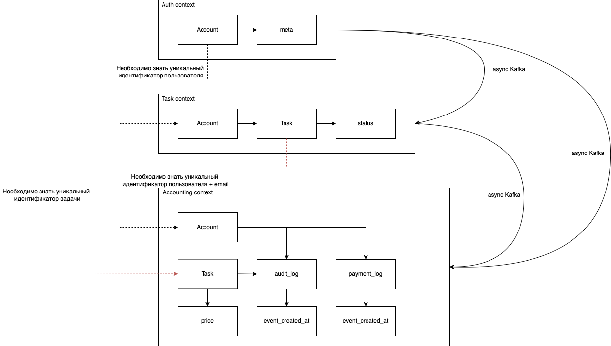

# async-architecture

# ДЗ 0 до курса (мега-тупое решение)

  

## Что тут в целом

Выделил два сервиса - Tasks, в котором будут храниться текущее состояние наших задач и пользователи, и Accounting, в котором будут храниться лог операций с задачами и лог выплат.

Общение между ними будет происходить асинхронно через кафку, но для одной операции сервиса Accounting (отправка уведомлений на почту) придется выполнить синхронный запрос в Tasks, чтобы получить имейлы. Можно их на стороне Accounting сохранять в кэш или писать имейл в таблицу с логом.

На стороне Tasks будет процесс, производящий запись в кафку, на стороне Accounting будут консьюмеры, процесс для агрегации лога операций с задачами в лог выплат, процесс для произведения выплат и процесс для уведомления по емейлу.

На стороне сервиса Tasks реализуем 5 ручек для отрисовки и функионирования дашборда таск трекера + 1 ручка для аналитики (самая дорогая задача).

На стороне сервиса Accounting реализуем 4 ручки для шаборда аккаунтинга, одну из них заюзаем для аналитики (сколько бизнес заработал по дням) + 1 ручка чисто для аналитики (количество попугов в минусе).

## Узкие места

- ~~Их нет~~
- Упадет сервис задач - отвалится часть админки и весь таск трекер, для каких то попугов не будут уходить письма о выплатах, как сервис поднимется - придут. Упадет сервис аккаунтинга - отвалится другая часть админки и весь аккаунтинг.
- Отрубится кафка - таск трекер продолжит работать, но попуги могут не получить плату за всю проделанную работу, потому что аккаунтинг не будет знать об изменениях по задачам. Как кафка поднимется - сервис задач докинет в аккаунтинг данные и оставшиеся выплаты должны пройти.
- Если упадет база данных, то будем пятисотить на ручках. В случае Tasks не будут двигаться задачи в принципе и добавляться списания, в случае Accounting не будет производится запись из кафки и списания. Наверно Accounting стоит чинить быстрее, чтобы партиции в кафке не росли. 
- Отвалится кэш - будем ддосить Tasks из Accounting во время отправки писем. 
- Возможно прилетят дубли из кафки - через uuid можно защититься кажется.

## Что улучшить
- Не понял как авторизация работает и откуда берутся пользователи в принципе.
- Ручки аккаунтинг возможно можно как-то упростить/ускорить, добавив таблицу с балансом для каждого попуга, но думаю сильно сложнее станет подсчет и запись денег - станет проще ошибиться. 
- Может быть сделать отдельный сервис для пользователей.

# ДЗ 1

## Разбиение требований

### Авторизация
- #### Пользователь входит в систему: 
    Actor: unlogged account
    Command: log in
    Data: credentials
    Event: account.logged_in

- #### Изменение данных пользователя / создание нового аккаунта
    Actor: account / admin account
    Command: change account data / create account
    Data: account_data(email, ...)
    Event: account.updated / account.created

### Задачи
- #### Новые таски может создавать кто угодно
    Actor: account
    Command: create task
    Data: task_description
    Event: task.created
- #### Создать задачу не заасайненую на пользователя нельзя
    Actor: task.created
    Command: assigne task
    Data: task_id
    Event: task.assigned
- #### При нажатии кнопки «заассайнить задачи» все текущие не закрытые задачи должны быть случайным образом перетасованы между каждым аккаунтом в системе
    Actor: admin / manager account
    Command: reassign tasks
    Data: - 
    Event: task.assigned
- #### Каждый сотрудник должен иметь возможность отметить задачу выполненной
    Query: get account tasks
    Actor: account
    Command: complete task
    Data: task_id
    Event: task.completed
- #### Каждый сотрудник должен иметь возможность видеть в отдельном месте список заассайненных на него задач
    Query: get account tasks
    Actor: account

### Аккаунтинг
- #### У обычных попугов доступ к аккаунтингу тоже должен быть. Но только к информации о собственных счетах (аудит лог + текущий баланс)
    Query: get user audit log
    Actor: account
- #### У админов и бухгалтеров должен быть доступ к общей статистике по деньгами заработанным (количество заработанных топ-менеджментом за сегодня денег + статистика по дням)
    Query: get all users audit log
    Actor: admin / accountant account
- #### У счёта должен быть аудитлог того, за что были списаны / начислены деньги
    Actor: task.assigned / task.completed
    Command: create audit log
    Data: task_id, user_id, ammount 
    Event: audir_log_record.created
- #### Цены на задачу определяется единоразово, в момент появления в системе 
    Actor: task.created
    Command: estimate task
    Data: task_id
    Event: task.estimated
- #### В конце дня необходимо считать сколько денег сотрудник получил за рабочий день / в аудитлоге всех операций аккаунтинга должно быть отображено, что была выплачена сумма
    Actor: end_of_day_event
    Command: create payment log
    Data: user_id
    Event: payment_log_record.created
- #### В конце дня необходимо отправлять на почту сумму выплаты
    Actor: payment_log_record.created
    Command: send email
    Data: user_email, other_meta
    Event: email.sent

### Аналитика (Подразумевается сделать на базе аккаунтинга)
- #### Нужно указывать, сколько заработал топ-менеджмент за сегодня
    Query: get all users audit log
    Actor: admin account
- #### Нужно указывать, сколько попугов ушло в минус
    Query: get users negative payment log
    Actor: admin account
- #### Нужно показывать самую дорогую задачу за день, неделю или месяц
    Query: get most expensive task in period
    Actor: admin account

## Модель данных, доменов, их связей

  

Аналитику планирую сделать надстройкой над сервисами задач и аккаунтинга, но в случае необходимости можно наверно настроить репликацию баз и сделать отдельный сервис.

## Бизнес-события системы
- #### account.logged_in
    Producer: auth
    Consumers: -
- #### task.assigned
    Producer: tasks
    Consumer: accounting
- #### task.completed
    Producer: tasks
    Consumers: accounting
- #### task.estimated
    Producer: accounting
    Consumers: accounting
- #### payment_log_record.created
    Producer: accounting
    Consumers: accounting
- #### audit_log_record.created
    Producer: accounting
    Consumers: -
- #### email.sent
    Producer: accounting
    Consumers: -

## CUD-события системы
- #### account.created, account.updated: 
    Producer: auth
    Consumers: tasks, accounting
- #### task.created, task.updated
    Producer: tasks
    Consumers: accounting

